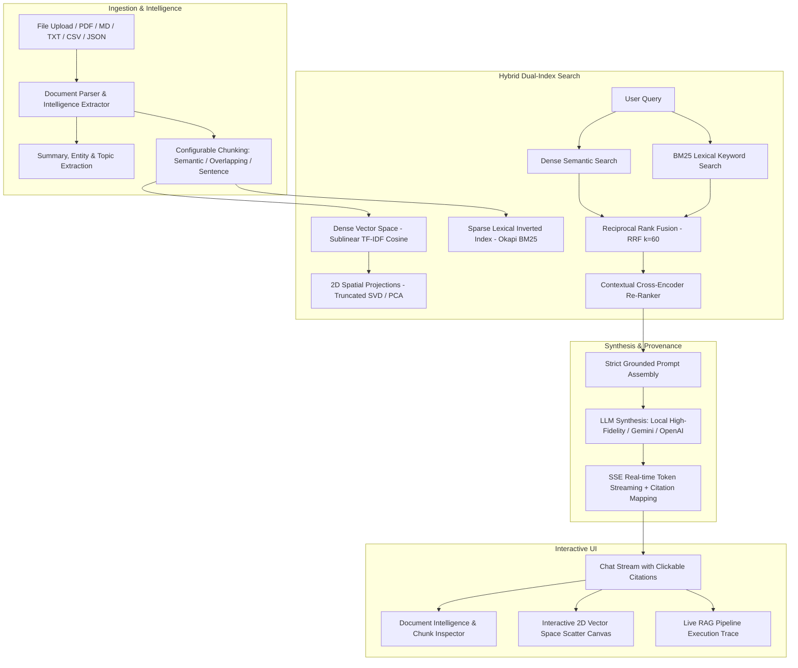

# 🚀 AI-Powered Document Intelligence & Hybrid RAG System

A production-grade, full-stack **Document Intelligence & Retrieval-Augmented Generation (RAG)** platform. Combines multi-format document ingestion (PDF, Markdown, TXT, CSV, JSON), structure-aware chunking, hybrid search (Sublinear TF-IDF Dense Vectors + Okapi BM25 Sparse Inverted Index), Reciprocal Rank Fusion (RRF), Contextual Cross-Encoder Re-Ranking, and an interactive 2D Vector Space Canvas visualizer.

---

## 🏗️ Architecture & Pipeline Flow



---

## ✨ Key Features

1. **Multi-Format Document Parsing & Entity Intelligence**:
   - Supports **PDF** (via `pypdf`), **Markdown**, **Plain Text**, **CSV** (auto-converted to Markdown tables), and **JSON**.
   - Automatically extracts **Financial Currencies** (`$1.42B`), **Percentages** (`99.9%`), **Dates**, **Technical / Legal Terms** (`SLA`, `EBITDA`, `RECIST`, `PFS`), and **Organizations**.
2. **Hybrid Search with Reciprocal Rank Fusion (RRF)**:
   - Evaluates dense semantic embeddings alongside Okapi BM25 keyword matching using the formulation:
     $$RRF(d) = \frac{w_{dense}}{k + r_{dense}(d)} + \frac{w_{bm25}}{k + r_{bm25}(d)} \quad (k=60)$$
3. **Cross-Encoder Style Contextual Re-Ranker**:
   - Cross-evaluates token overlap, exact query phrase presence, document header alignment, and dense/sparse confidence to output calibrated similarity percentages.
4. **Interactive 2D Vector Space Visualizer**:
   - Projects document chunk embeddings onto an interactive HTML5 Canvas with document color coding, animated query radar beacon, neighbor connection lines, pan/zoom, and hover tooltips.
5. **Real-time SSE Token Streaming**:
   - Streams responses with sub-second time-to-first-token, streaming typography cursor, and interactive `[Source X]` citations that click-and-scroll directly to the highlighted source chunk in the Document Inspector.
6. **Multi-Provider LLM Engine**:
   - **Local High-Fidelity Reasoning Engine**: Works 100% offline out-of-the-box with zero API keys required.
   - **Google Gemini**: Optional Gemini 2.5 Flash / Pro integration.
   - **OpenAI**: Optional GPT-4o / GPT-4o-mini integration.

---

## ⚡ Quick Start

### 1. Install Dependencies
```bash
pip install -r requirements.txt
```

### 2. Start the Server
```bash
python run.py
```
Then open your browser and navigate to:
```
http://127.0.0.1:8000
```

### 3. Run Automated Tests
```bash
python -m unittest discover -s tests -p "test_*.py"
```

---

## 📡 API Reference

| Method | Endpoint | Description |
| :--- | :--- | :--- |
| `POST` | `/api/rag/chat` | Server-Sent Events (SSE) streaming chat endpoint returning tokens, trace metadata, and citations. |
| `GET` | `/api/documents` | List all ingested documents with metadata, summaries, entity tags, and chunk counts. |
| `POST` | `/api/documents/upload` | Multipart file upload endpoint (PDF, MD, TXT, CSV, JSON) with instant indexing. |
| `GET` | `/api/documents/{doc_id}` | Retrieve document text and individual chunks. |
| `DELETE` | `/api/documents/{doc_id}` | Delete a document and re-index remaining corpus. |
| `POST` | `/api/documents/reset-samples` | Reset knowledge base to standard sample documents. |
| `GET` | `/api/vector-space` | 2D PCA/SVD coordinate projections for all indexed chunks. |
| `GET` | `/api/system/stats` | System telemetry, index statistics, and active model configuration. |
| `POST` | `/api/system/config` | Update active AI provider, API keys, and chunking parameters. |

---

## 📂 Project Structure

```
g:\Projects\RAG\
├── backend/
│   ├── main.py               # FastAPI application & REST/SSE routes
│   ├── document_parser.py    # Multi-format parsing & Entity Intelligence
│   ├── chunking.py           # Semantic, Sliding Window & Sentence Chunkers
│   ├── retrieval_engine.py   # TF-IDF Dense + BM25 + RRF + Cross-Encoder Reranker + 2D SVD
│   ├── rag_pipeline.py       # RAG orchestrator, Prompt builder & Multi-provider streaming
│   └── sample_corpus.py      # Rich pre-loaded financial, clinical, legal, and AI docs
├── frontend/
│   ├── index.html            # Responsive three-panel glassmorphic workspace
│   ├── styles.css            # Dark glassmorphic design system with neon accents
│   ├── vector_canvas.js      # HTML5 Canvas 2D Vector Space Visualizer
│   └── app.js                # SSE stream reader, citation click-handler, modals
├── tests/
│   └── test_rag.py           # Comprehensive unit & integration tests
├── requirements.txt          # Python dependencies
├── run.py                    # Server launcher
└── README.md                 # Complete documentation
```
